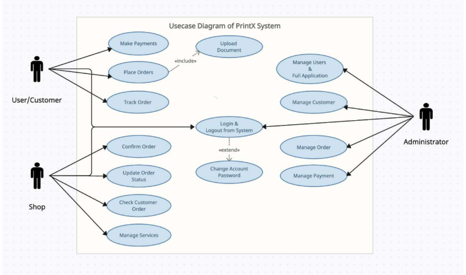
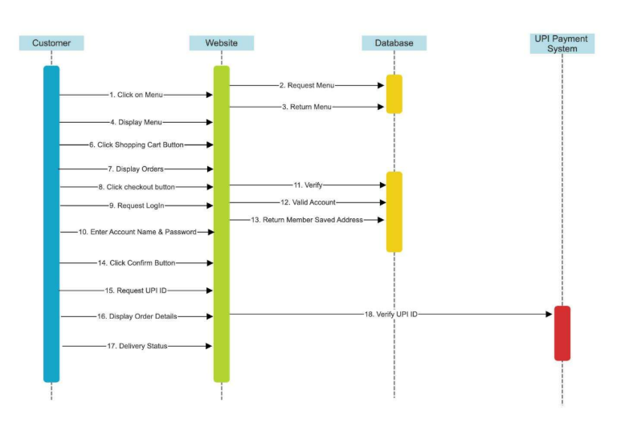
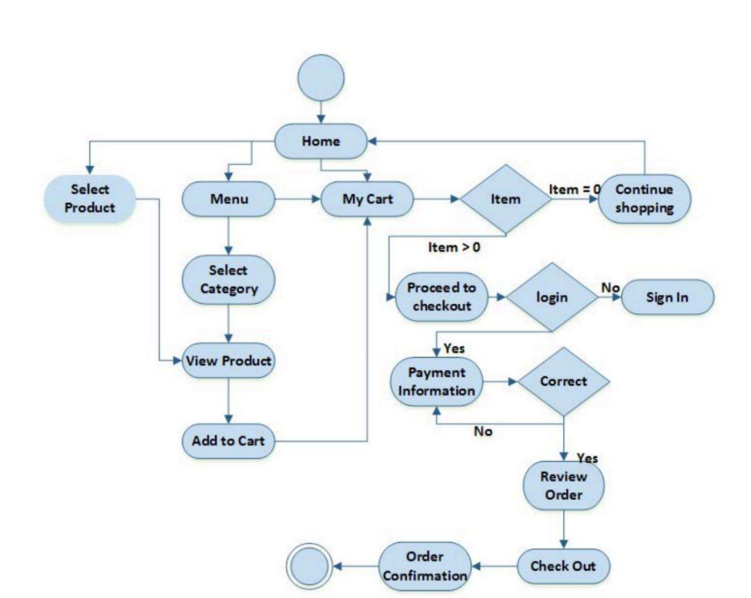
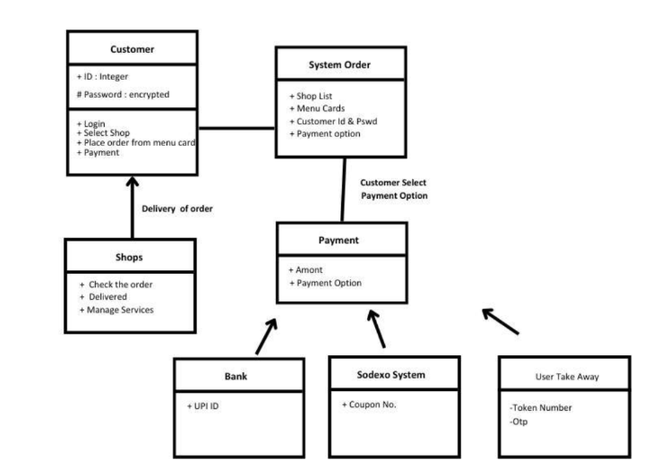

# 🖨️ PrintX  
**Smart Printing Platform for Students – Find, Upload, Print, Collect**

---

## 📌 Overview  
PrintX is a web-based platform that connects students with nearby printing shops, enabling a seamless digital printing workflow. Users can upload documents, select printing preferences, choose a nearby shop, and place orders online. Shop owners process these requests and update order status, allowing users to collect their printed documents once ready.

The platform addresses a common problem faced by students—**wasting time in queues for printing services**—by digitizing and streamlining the entire process.

Additionally, Google Drive is used for document storage to ensure ease of access and familiarity for shop owners, avoiding the need for complex infrastructure.

---

## 🎯 Key Features  
- 📍 Discover nearby printing shops  
- 📄 Upload documents for printing  
- 🖨️ Select print options (pages, copies, format, etc.)  
- 📦 Place and manage print orders  
- 🔄 Real-time order status tracking  
- 🧑‍💼 Shop dashboard to manage incoming requests  
- ✅ Order completion update by shop owner  

---

## 🏗️ System Architecture  
PrintX follows a modular and service-oriented architecture:

- **User Module:** Upload documents, place orders, track status  
- **Shop Module:** Receive and process print requests  
- **Order Management System:** Handles the lifecycle of print jobs  
- **Storage Layer:** Uses Google Drive for document storage  
- **Location Layer:** Displays nearby shops  

Designed for **scalability, simplicity, and efficient interaction between users and shop owners**

---
## 🏗️ System Design & Diagrams  

### 🔹 Use Case Diagram (PrintX)  

### 🔹 Sequence Diagram (Order Flow)  

### 🔹 Activity Diagram  

### 🔹 Class Diagram (Order Management)  

---

## 🛠️ Tech Stack  
- **Frontend:** React  
- **Backend:** Node.js / Express  
- **Database:** MongoDB  
- **Storage:** Google Drive (for document handling)  

---

## ⚙️ Key Technical Highlights  
- Integration with Google Drive API for document storage and retrieval  
- Efficient file upload and document management system  
- Order lifecycle management (Placed → Processing → Completed)  
- Role-based access system (User / Shop Owner)  
- Scalable REST API design for handling concurrent users  

---

## 📊 Functional Flow  
1. User selects a nearby print shop  
2. Uploads document and chooses print settings  
3. Places order  
4. Shop owner receives and processes request  
5. Shop marks order as **completed/printed**  
6. User gets update and collects documents  

---

## 🧪 Challenges  
- Handling document uploads efficiently  
- Designing a smooth workflow between users and shop owners  
- Managing concurrent requests from multiple users  
- Ensuring simplicity for non-technical users  

---

## 📚 Learnings  
- Designing real-world service platforms  
- Backend workflow and order management systems  
- Trade-offs between scalability and simplicity  
- Importance of user-centric design decisions  

---

## 🔐 Code Availability  
> The source code is kept private to maintain system integrity and project ownership.  
> This repository focuses on system design, architecture, and project understanding.  
> Code can be shared upon request for academic/research evaluation.

---
## ⚙️ Design Decisions  
- Used Google Drive for document storage to ensure ease of access for shop owners  
- Chose MongoDB for flexible schema and scalability  
- Designed modular backend for handling multiple concurrent users  

---
## 🚀 Future Scope  
- 🚚 Online delivery of printed documents  
- 🔔 Real-time notifications for order updates  
- 💳 Online payment integration  
- 📱 Mobile application  
- ⚡ Distributed job processing for high-demand scenarios  

---

## 🎯 Target Users  
- School students  
- College students  
- Coaching institute students  

---

## ⭐ Why This Project  
PrintX solves a practical, real-world problem by digitizing the printing process. It demonstrates **system design, real-time workflow management, and scalable backend development** while focusing on usability for non-technical users.

---
## 📄 Project Report  
👉https://drive.google.com/file/d/1CLadM1QwuZf6jsetKfy6UWK0-gsG3mcT/view?usp=drive_link
